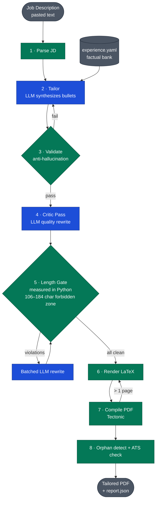

# JobPlanner

Automated resume tailoring pipeline. Paste a job description, get a tailored, ATS-compliant, one-page PDF resume.

## How It Works

JobPlanner uses a **synthesis approach**: instead of storing pre-written resume bullets, you maintain an **experience bank** (a single YAML file) containing factual descriptions of your work, skills, and metrics. An LLM reads a job description and synthesizes resume-ready bullets on the fly — framing your experience for the specific role.

### Pipeline Stages



<sub>Blue = LLM call · Green = deterministic Python/LaTeX · Grey = I/O</sub>

1. **Parse JD** — Extract title, company, required skills, role type from the job description
2. **Tailor Resume** — LLM selects experiences/projects and synthesizes bullets matched to the JD
3. **Validate** — Anti-hallucination checks ensure every claim traces back to the experience bank
4. **Critic Pass** — A second LLM pass rewrites weak bullets for specificity, action verbs, and JD alignment
5. **Length Gate** — Python measures every bullet against the 106–184 char forbidden zone and issues one batched rewrite if any land there (LLMs can't reliably count characters). Zero API cost on clean runs.
6. **Render LaTeX** — Jinja2 template generates a `.tex` file with configurable spacing
7. **Compile PDF** — Tectonic compiles to PDF with automatic one-page retry loop; PyMuPDF then scans the rendered PDF for 1–5-word orphan tails and surfaces them as warnings
8. **ATS Check** — Extracts text from the PDF and scores keyword coverage against the JD

## Features

- **Synthesis mode** — bullets are written fresh per JD, not just shuffled from a template
- **Anti-hallucination validation** — every bullet must cite its source in the experience bank
- **ATS keyword scoring** — checks how many JD keywords appear in the final PDF
- **One-page auto-fit** — progressive spacing adjustments + content trimming to guarantee one page
- **Programmatic orphan defense** — Python-side line-fill gate plus LaTeX microtype/ragged2e tuning and PDF-side orphan detection, layered so nothing slips through
- **Persistent bank suggestions** — each run surfaces weak-bullet diagnostics; accumulated across JDs in a local SQLite DB and browsable in the Web UI's Bank Health tab
- **Multi-LLM** — supports Claude (Anthropic) and OpenAI models
- **Audience-aware** — frames the same experience differently for SWE vs DS vs finance roles
- **CLI + Web UI** — Click CLI for automation, Streamlit app for interactive use

## Quick Start

### 1. Install

```bash
pip install -e .
```

### 2. Set up your experience bank

```bash
cp data/experience.example.yaml data/experience.yaml
```

Edit `data/experience.yaml` with your own education, experience, projects, and skills. This single file is all you need — it's your portable personal data. See the example file for the full schema.

### 3. Set API keys

Set at least one provider's API key. Keys are resolved in order: **environment variable → Python `keyring` → PowerShell SecretStore (Windows-only fallback)**.

```bash
export OPENAI_API_KEY="sk-..."
# or
export ANTHROPIC_API_KEY="sk-ant-..."
```

Prefer keyring for long-lived setup (cross-platform — macOS Keychain, Windows Credential Manager, Linux Secret Service):

```bash
python -c "import keyring; keyring.set_password('jobplanner', 'JP-openai-apikey', 'sk-...')"
python -c "import keyring; keyring.set_password('jobplanner', 'JP-claude-apikey', 'sk-ant-...')"
```

On Windows you can also use PowerShell SecretStore (see [Configuration](#configuration)).

### 4. Install tectonic

[Tectonic](https://tectonic-typesetting.github.io/) is a modern LaTeX compiler. Install it via your package manager:

```bash
# macOS
brew install tectonic

# Windows (scoop)
scoop install tectonic

# Linux
# See https://tectonic-typesetting.github.io/en-US/install.html
```

### 5. Run

```bash
# Save a job description to a text file, then:
python -m jobplanner tailor --jd job_description.txt

# Use a specific model:
python -m jobplanner tailor --jd job.txt --model claude-sonnet-4-6
```

## CLI Reference

| Command | Description |
|---------|-------------|
| `jobplanner tailor --jd <file>` | Full pipeline: parse, tailor, validate, render, compile, ATS check |
| `jobplanner preview --jd <file>` | Dry run — parse + tailor only, no PDF |
| `jobplanner compile <file.tex>` | Compile a `.tex` file to PDF |
| `jobplanner ats-check <file.pdf>` | Run ATS keyword check on an existing PDF |
| `jobplanner bank validate` | Validate `experience.yaml` against the schema |
| `jobplanner bank show` | Display experience bank summary |
| `jobplanner bank update` | AI-assisted bank update (describe changes in natural language) |
| `jobplanner bank add` | Interactively scaffold a new experience or project entry |
| `jobplanner bank edit` | Open `experience.yaml` in your default editor |

Use `--model` to override the default model on any command that calls an LLM.

## Experience Bank

The experience bank (`data/experience.yaml`) is the single source of truth. Its key design principles:

- **Factual descriptions, not resume text.** Write what you did, the tech you used, and the results. The LLM synthesizes resume-ready bullets.
- **Per-bullet metadata.** Each bullet has `description`, `tech_stack`, `skills`, `metrics`, and `context`.
- **Anchor projects.** Set `anchor: true` on projects that should always appear on your resume, even if their tags don't match the JD.
- **Inferred skills.** Skills derived from coursework can be listed with a `basis` and `confidence` level. They may appear in the skills section but are never used to fabricate experience bullets.
- **Source tracking.** Every tailored bullet cites which source bullets it drew from via `source_bullet_indices`.

See `data/experience.example.yaml` for the full schema with comments.

## Web UI

```bash
pip install -e ".[web]"
streamlit run src/jobplanner/app.py
```

The Streamlit app has two tabs:

- **Resume Tailor** — paste a JD, pick a model, run the pipeline, preview and download the PDF, and see ATS coverage, critic summary, and orphan/length warnings in one view.
- **Bank Health** — every run persists weak-bullet suggestions into a local SQLite DB. This tab lets you browse accumulated suggestions across JDs, sort by frequency/priority/recency, and jump straight to the source bullet in `experience.yaml` via Edit-in-Bank.

## Configuration

### Environment Variables

| Variable | Description | Default |
|----------|-------------|---------|
| `OPENAI_API_KEY` | OpenAI API key | — |
| `ANTHROPIC_API_KEY` | Anthropic (Claude) API key | — |
| `JOBPLANNER_MODEL` | Default model | `gpt-5.4-mini` |
| `JOBPLANNER_DATA_DIR` | Personal-data root (see [Personal Data Sync](#personal-data-sync)) | repo's `data/` |

### Personal Data Sync

`experience.yaml` and `market/skill_tracker.db` are personal data. Point `JOBPLANNER_DATA_DIR` at a folder-sync location (Google Drive, Dropbox, iCloud, Syncthing…) to use the same bank and tracker DB across machines. Templates and guidelines stay under the repo's `data/` regardless.

Expected layout under `JOBPLANNER_DATA_DIR`:

```
JobPlannerData/
├── experience.yaml
└── market/
    └── skill_tracker.db
```

The SQLite tracker is binary and cannot be merged — wait for the sync to settle before switching laptops mid-edit, or you risk a conflict copy. The `output/` folder is intentionally not synced (regenerable per machine).

### Model Aliases

Use short aliases with `--model`:

| Alias | Model |
|-------|-------|
| `gpt-5.4` | OpenAI GPT-5.4 |
| `gpt-5.4-mini` | OpenAI GPT-5.4 Mini |
| `gpt-5.4-nano` | OpenAI GPT-5.4 Nano |
| `claude-sonnet-4-6` | Claude Sonnet 4.6 |
| `claude-haiku-4-5` | Claude Haiku 4.5 |
| `claude-opus-4-6` | Claude Opus 4.6 |

### PowerShell SecretStore (Windows)

Alternative to environment variables for secure API key storage:

```powershell
Install-Module Microsoft.PowerShell.SecretManagement -Scope CurrentUser -Force
Install-Module Microsoft.PowerShell.SecretStore -Scope CurrentUser -Force
Register-SecretVault -Name 'SecretStore' -ModuleName 'Microsoft.PowerShell.SecretStore' -DefaultVault
Set-SecretStoreConfiguration -Authentication None -Confirm:$false
Set-Secret -Name 'JP-openai-apikey' -Secret '<your-key>'
Set-Secret -Name 'JP-claude-apikey' -Secret '<your-key>'
```

## Project Structure

```
src/jobplanner/
  llm/          LLM abstraction (protocol + Claude/OpenAI clients)
  bank/         Experience bank: schema, loader, locator, AI-assisted updater, persistent suggestions
  parser/       Job description parser
  tailor/       Resume tailoring agent + hallucination validator + programmatic length gate
  latex/        Jinja2 renderer + tectonic PDF compiler + orphan detector
  checker/      ATS text extraction, proofreader, post-tailor critic
  market/       Skill-tracker SQLite DB (shared with bank/suggestions)
  cli.py        Click CLI entry point
  __main__.py   `python -m jobplanner ...` entry point
  app.py        Streamlit web UI
  pipeline.py   End-to-end orchestrator
  config.py     Settings, model mapping, secret resolution
data/
  experience.example.yaml   Schema reference (copy to experience.yaml)
  templates/                Jinja2 LaTeX templates
  examples/                 Sample job descriptions
```

## Requirements

- Python 3.11+
- [tectonic](https://tectonic-typesetting.github.io/) (LaTeX compiler)
- At least one API key (OpenAI or Anthropic)
